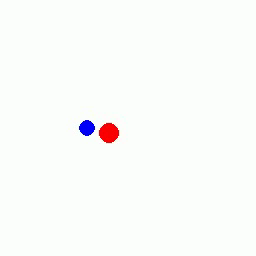
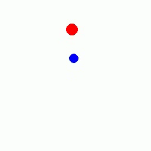
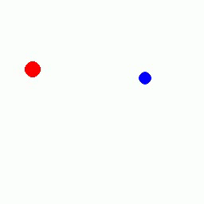

# pi-e: Policy with Experience

**Hypothesis**: robot policies that can draw on persistent experience — not just the current observation window — will generalize better to tasks requiring spatial recall, object permanence, and long-horizon reasoning.

This repository is a ground-up implementation track toward that hypothesis: rebuild the core ingredients of modern VLA policies one component at a time, in a controlled simulation where each architectural change is attributable and measurable. Once the generative action model is in place, memory is the next experimental variable.

The name reflects the end goal. Current "memory" in most policies is just the context window — a fixed lookback of frames. *pi-e* is built to eventually test what happens when you replace or augment that with richer, persistent experience.

---

## Progression

Each stage is implemented from scratch and evaluated before the next is added:

| # | Component | Status |
|---|-----------|--------|
| 1 | Expert policy (rule-based) | done |
| 2 | Behavior cloning (single-frame) | done |
| 3 | DAgger (covariate shift correction) | done |
| 4 | Action chunking (open-loop + receding horizon) | done |
| 5 | ACT-style transformer decoder with action queries | done |
| 6 | ViT encoder + transformer decoder | done |
| 7 | Evaluation harness with rollout metrics | done |
| 8 | Flow-matching action head | next |
| 9 | Language conditioning (VLA) | upcoming |
| 10 | Memory experiments | upcoming |

---

## Experimental Setting

2D interception task:

- Observation: RGB image
- Action: `(dx, dy)` end-effector velocity
- Goal: move blue end-effector to capture red bouncing ball

The environment is intentionally simple so that model and control changes are attributable and measurable. Complexity is added to the policy, not the environment.

---

## Results

Evaluated over 300 rollouts per policy with fixed seed and settings.

| Policy | Steps to Capture | Path Inefficiency | Completed Rate | Params |
|--------|----------------:|------------------:|---------------:|-------:|
| Expert | 16.83 ± 10.25 | 1.06 ± 0.07 | 1.000 | N/A |
| BC + DAgger | 31.55 ± 26.58 | 1.38 ± 0.95 | 0.910 | 4.2M |
| ACT (RH4) | 23.98 ± 15.22 | 1.20 ± 0.26 | 1.000 | 69K |
| ViT (RH4) | 25.39 ± 15.90 | 1.24 ± 0.52 | 1.000 | 287K |
| Random | 89.99 ± 26.47 | 14.54 ± 13.45 | 0.157 | N/A |

Takeaways:

- Receding-horizon ACT and ViT reach expert-level completion at 69K and 287K parameters respectively.
- ACT is 60× more parameter-efficient than the flatten+MLP BC baseline while outperforming it on every metric.
- Transformer-based policies close most of the gap to the expert while using far fewer parameters than MLP heads.

Full breakdown including action chunking, open-loop variants, smoothness, and trajectory length: [`notes/10_baseline_metrics.md`](notes/10_baseline_metrics.md).

---

## Video Highlights

| BC + DAgger | ACT (RH4) | ViT (RH4) |
|-------------|-----------|-----------|
| [](notes/videos/06_bc_policy_dagger.mp4) | [](notes/videos/08_act_policy_small_rh4.mp4) | [](notes/videos/09_vit_policy_patch16_rh4.mp4) |

---

## What Was Learned at Each Stage

**BC → DAgger**: Expert demonstrations undersample failure-recovery states. DAgger corrects covariate shift by labeling states the learned policy actually visits, not just states the expert visits.

**Action chunking**: Open-loop chunk execution is surprisingly fragile on dynamic targets. Receding-horizon execution (re-plan every 4 steps) recovers most of the gap at no architectural cost.

**Transformer decoder (ACT)**: Learned action queries replace the flattened CNN output + MLP head. The result is better performance at 60× fewer parameters — the decoder adds structure that the MLP cannot.

**ViT encoder**: Replacing the CNN with a patch-based ViT encoder gives comparable performance at a higher parameter cost, but establishes the backbone for language conditioning later.

**Multi-frame stacking (abandoned)**: Frame stacking (concatenating along channels, à la DQN) was implemented and discarded. A CNN treats all channels equally; it provides no temporal inductive bias. Attention over frame sequences or action chunking is the right path.

---

## Technical Scope

```
pi/
├── env/                  # simulation environment
├── expert/               # rule-based expert policy
├── policy/               # learned policies (BC, chunking, ACT, ViT)
│   ├── bc_policy.py
│   ├── action_chunking_policy.py
│   ├── act_policy.py
│   └── vit_policy.py
├── data/                 # datasets + dataloaders
├── scripts/              # training / collection scripts
├── eval/                 # metric computation + evaluation runners
├── experiments/          # ablation matrix, run log, findings journal
├── notes/                # implementation notes, metrics, videos
└── visualize.py          # interactive visualization
```

---

## Running

```bash
# Visualize expert
python visualize.py

# Train
python scripts/train.py

# Evaluate
python eval/run_eval.py
```

---

## Current Limitations

1. **Task simplicity**: the interception environment does not yet test long-horizon planning, memory, or complex contact dynamics — by design, but a real constraint on what the current results claim.
2. **Script ergonomics**: train/eval entrypoints are script-based and not yet unified into a single configurable CLI.
3. **Dataset scope**: demonstrations are from one toy domain; no cross-task or multi-domain pretraining.
4. **No flow matching yet**: action generation is still regression-based, not generative.
5. **No language conditioning yet**: VLA behavior is planned but not implemented.

---

## Next Milestones

1. **Flow-matching action head** — drop-in replacement for direct regression; the natural next step before generative VLA behavior.
2. **Language-conditioned control** — minimal language conditioning on top of the ViT/ACT backbone.
3. **Harder tasks** — partial observability, multi-step goals, variable dynamics.
4. **Memory experiments** — test whether persistent experience (episodic memory, spatial recall) improves policies on tasks that exceed a single observation window. The frame-lookback context that current policies use is a lower bound on what memory could be.

---

## Reproducibility

- Evaluation: `eval/run_eval.py`
- Environment: `MovingObjectEnv` (`env/moving_object.py`)
- Episodes per policy: 300
- Max steps: 100
- Seed: 42
- RH4 variants share the same checkpoint; only `actions_per_inference=4` changes.
- Full metric details: `notes/10_baseline_metrics.md`
- Experiment log: `experiments/runs.csv`

---

## Notes

- Implementation writeups: `notes/`
- Baseline metrics + charts: `notes/10_baseline_metrics.md`
- Technical report outline: `notes/11_technical_report_outline.md`
- Rollout videos: `notes/videos/`
- Experiment workflow: `experiments/README.md`
