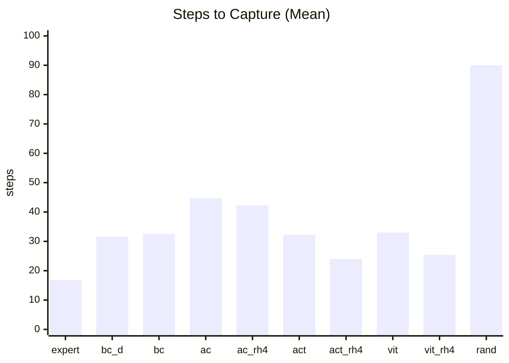
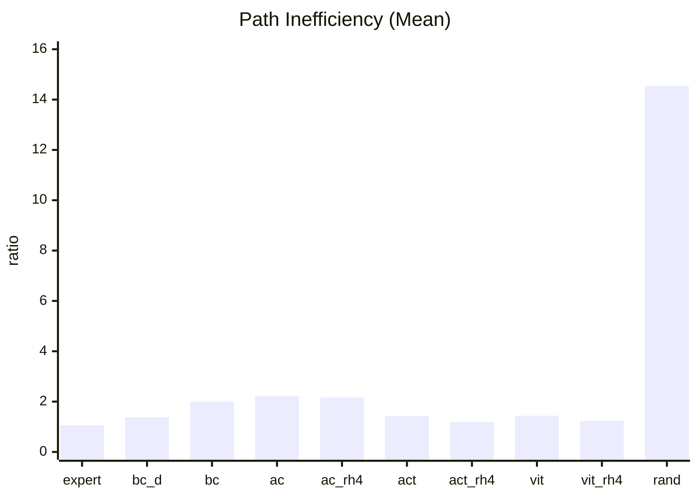

# Step 10: Baseline Metrics and Evaluation Protocol

## Goal

Define a small, consistent benchmark suite so model changes (ACT, ViT, Flow Matching, VLA) can be compared fairly.

For now, prioritize metrics that are informative in the current simple interception environment.

## Why This Matters

Without stable metrics, it's easy to overfit to qualitative videos or isolated rollouts. A baseline suite gives:

1. Comparable numbers across policy families
2. Early detection of regressions
3. A reliable target for Flow Matching and later VLA work

## Core Metrics (Use Now)

### 1) Steps to Capture (Primary)

- Definition: number of environment steps until red ball is captured
- Lower is better
- If no capture by timeout, record as timeout value (or mark as fail, see reliability metric)
- Why: more informative than binary success when success saturates at high timeout

### 2) Path Efficiency

- Definition A (absolute): total end-effector trajectory length
- Definition B (normalized): path inefficiency ratio
  - `ratio = trajectory_length / straight_line_distance(start_ee, capture_position)`
- Lower is better (minimum possible is near 1.0 for ratio form)
- Why: captures directness vs wandering

### 3) Action Smoothness

Use two complementary terms:

- Direction consistency:
  - for consecutive commanded velocities `v_t, v_(t+1)`
  - cosine similarity: `cos_t = dot(v_t, v_(t+1)) / (||v_t|| * ||v_(t+1)|| + eps)`
  - aggregate with mean over episode
  - higher is smoother in direction
- Magnitude continuity:
  - `delta_mag_t = ||v_(t+1) - v_t||`
  - aggregate with mean over episode
  - lower is smoother in magnitude

Why both:
- Dot/cosine catches direction flips
- Delta magnitude catches abrupt speed jumps

## Reliability (Make Non-Saturated)

Current issue: with timeout=100, most policies succeed, so success rate saturates.

Approach:

1. Sweep timeout values (example: 20, 30, 40, 50, 75, 100)
2. Pick a timeout where policies are separated but not all failing
3. Report:
   - success rate at chosen timeout
   - steps-to-capture among successful episodes

## Early Robustness (Lightweight, Optional Now)

Even in a simple simulation, add seed variability:

- Evaluate each policy on multiple random seeds (example: 5)
- Report mean and standard deviation for steps-to-capture and path efficiency

Interpretation:
- Lower variance indicates more stable behavior under small initial-condition changes

## Recovery Proxy (Optional)

No perfect recovery metric yet, so use a proxy:

- Define a "drift event": distance to ball increases for `k` consecutive steps (e.g., `k=3`)
- Recovery success: after a drift event, policy eventually captures within remaining episode budget
- Report recovery rate = recovered drift events / total drift events

This approximates overshoot-and-recover behavior.

## Efficiency Metadata (Track, Low Priority)

Not a primary decision metric yet, but log:

1. Inference latency per step (ms)
2. Parameter count

Reason:
- Useful historical context as models grow
- Can become a first-class metric after architecture simplification/pruning

## Proposed Reporting Template

Per policy (ACT, ViT, future Flow):

1. `success_rate@T`
2. `mean_steps_to_capture` (plus std)
3. `mean_path_length` or `mean_path_ratio` (plus std)
4. `mean_action_cosine` and `mean_delta_action_norm`
5. `inference_ms_per_step` and `params`

## Evaluation Protocol (v0)

1. Fix evaluation seeds
2. Run fixed number of episodes per seed
3. Use identical timeout and environment settings across policies
4. Save aggregated metrics to a single table in notes
5. Optionally attach one representative video per policy

## Baseline Results (Initial Pass)

The following table captures the current evaluation snapshot (mean ± std from your latest run).

| Policy | Steps to Capture | Path Inefficiency | Direction Consistency | Magnitude Continuity | Completed Rate | Trajectory Length |
|---|---:|---:|---:|---:|---:|---:|
| Expert | 16.83 ± 10.25 | 1.06 ± 0.07 | 0.982 ± 0.029 | 0.031 ± 0.045 | 1.000 ± 0.000 | 103.03 ± 61.46 |
| BC + DAgger | 31.55 ± 26.58 | 1.38 ± 0.95 | 0.929 ± 0.097 | 0.135 ± 0.084 | 0.910 ± 0.286 | 142.52 ± 98.48 |
| BC | 32.62 ± 31.41 | 2.00 ± 12.79 | 0.969 ± 0.039 | 0.094 ± 0.054 | 0.840 ± 0.367 | 136.32 ± 96.18 |
| Action Chunking | 44.69 ± 29.03 | 2.23 ± 3.05 | 0.907 ± 0.056 | 0.114 ± 0.044 | 0.890 ± 0.313 | 209.14 ± 130.65 |
| Action Chunking (RH4) | 42.27 ± 30.35 | 2.16 ± 2.60 | 0.877 ± 0.090 | 0.150 ± 0.069 | 0.860 ± 0.347 | 193.05 ± 133.11 |
| ACT | 32.26 ± 20.55 | 1.42 ± 0.77 | 0.939 ± 0.059 | 0.113 ± 0.068 | 0.983 ± 0.128 | 152.86 ± 93.02 |
| ACT (RH4) | 23.98 ± 15.22 | 1.20 ± 0.26 | 0.911 ± 0.111 | 0.140 ± 0.097 | 1.000 ± 0.000 | 128.04 ± 77.84 |
| ViT | 33.03 ± 22.02 | 1.44 ± 1.03 | 0.933 ± 0.065 | 0.114 ± 0.059 | 0.977 ± 0.151 | 153.13 ± 96.46 |
| ViT (RH4) | 25.39 ± 15.90 | 1.24 ± 0.52 | 0.915 ± 0.087 | 0.125 ± 0.076 | 1.000 ± 0.000 | 131.34 ± 77.24 |
| Random | 89.99 ± 26.47 | 14.54 ± 13.45 | 0.009 ± 0.159 | 0.681 ± 0.096 | 0.157 ± 0.363 | 344.02 ± 102.11 |

### Parameter Counts

Counts are from model definitions (policy architecture only; RH4 variants share the same parameter count as their base policy).

| Model | Parameters |
|---|---:|
| BC | 4,207,906 |
| Action Chunking | 4,208,816 |
| ACT | 69,282 |
| ViT | 287,426 |
| Expert | N/A (hand-coded policy) |
| Random | N/A |

### Quick Read

1. Expert remains strongest in this environment on speed and path directness.
2. Receding horizon improves ACT/ViT substantially vs open-loop counterparts.
3. Random baseline is clearly separated on all metrics, validating metric signal.
4. BC path inefficiency variance is very large; likely occasional degenerate episodes/outliers.

## Quick Charts

Lower is better for both charts below.

## Status

In Progress (metrics defined and first benchmark snapshot recorded)
